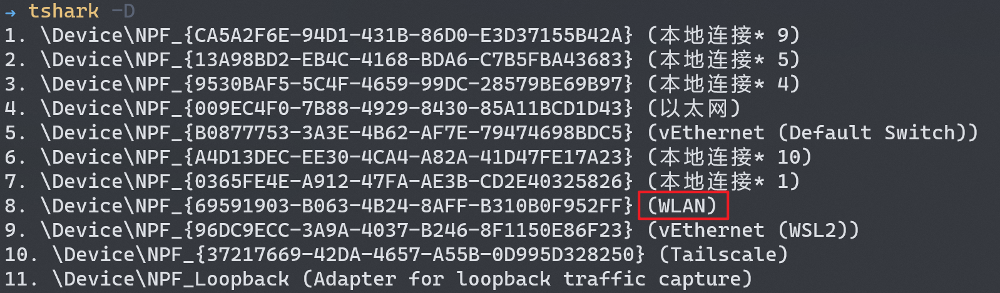
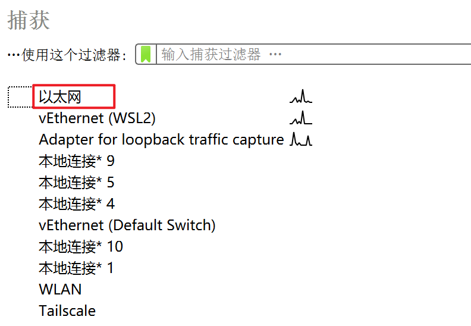

## 当前版本
- 仍需要在脚本运行前手动配置质差

- 无需再手动登录

- 视频播放列表可配置，可在 config.yaml 中修改 play_list
- 每次运行脚本，将自动进行抓包和抓日志，脚本将自动播放 play_list 的每个视频，并将每个视频的流量和日志保存到 'output\视频ID' 目录下
- 目前配置了20个视频，即每次运行脚本将自动在当前的质差条件下采集20组数据

## 依赖
- tshark，需要将 tshark 加入环境变量
- python paramiko 库，用于远程登录服务器
- python pyyaml 库，用于解析配置文件

## 使用方法
- 1. 在 config.yaml 中修改 net_interface，为抓包的网卡名，请选择流量经过的网卡，可以通过 'tshark -D' 查看，也可以在 Wireshark 中查看，示例：
 tashark -D:
 
  Wireshark:

- 2. 手动设置质差，运行 main.py，脚本将自动播放 play_list 中的每个视频，并将每个视频的流量和日志保存到 'output\视频ID' 目录下，运行结束可以将 output 目录重命名，以采集新的数据

- 3. 视频播放过程中请不要将浏览器最小化，最小化时视频会暂停播放，但可以被其他窗口遮挡

## TODO
- [ ] 无需手动配置质差
- [ ] 指定播放分辨率
- [ ] 边采集边计算MOS